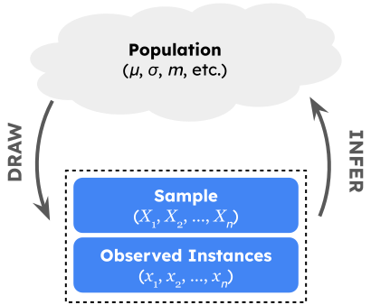
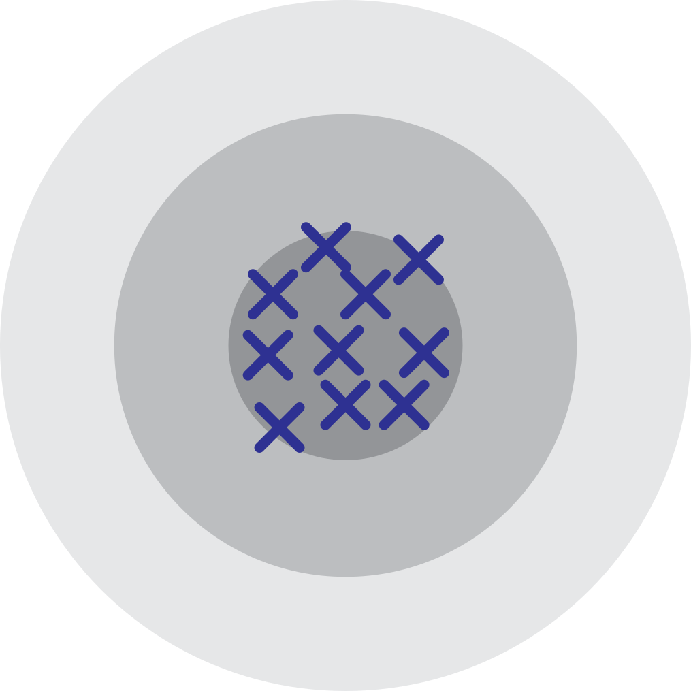
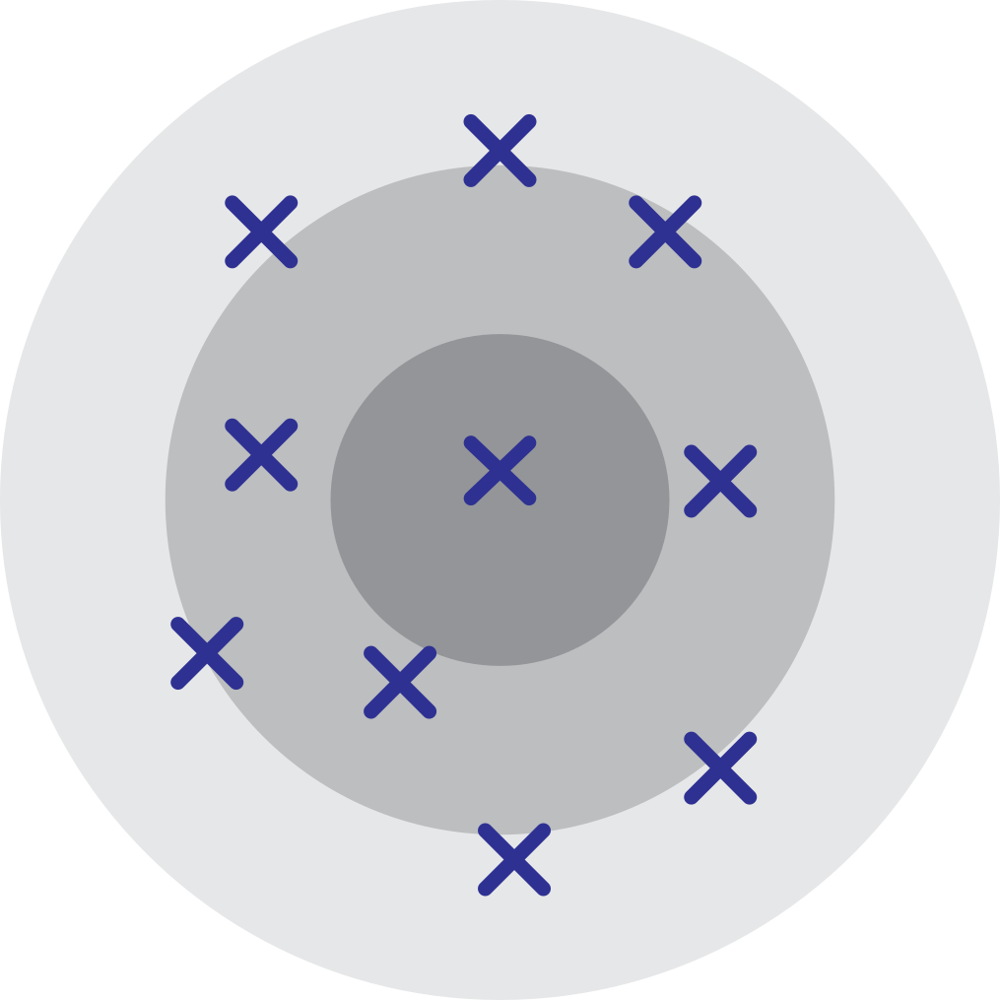
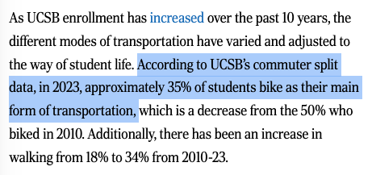

<style>
mjx-math {
  font-size: 80% !important;
}
</style>

<script>
MathJax = {
  options: {
    menuOptions: {
      settings: {
        assistiveMml: false
      }
    }
  }
};
</script>
<script type="text/javascript" id="MathJax-script" async src="path-to-MathJax/tex-chtml.js"></script>


$$
\newcommand\R{\mathbb{R}}
\newcommand{\N}{\mathbb{N}}
\newcommand{\E}{\mathbb{E}}
\newcommand{\S}{\mathbb{S}}
\newcommand{\Prob}{\mathbb{P}}
\newcommand{\F}{\mathcal{F}}
\newcommand{\1}{1\!\!1}
\newcommand{\comp}[1]{#1^{\complement}}
\newcommand{\Var}{\mathrm{Var}}
\newcommand{\SD}{\mathrm{SD}}
\newcommand{\vect}[1]{\vec{\boldsymbol{#1}}}
\newcommand{\tvect}[1]{\vec{\boldsymbol{#1}}^{\mathsf{T}}}
\newcommand{\hvect}[1]{\widehat{\boldsymbol{#1}}}
\newcommand{\mat}[1]{\mathbf{#1}}
\newcommand{\tmat}[1]{\mathbf{#1}^{\mathsf{T}}}
\newcommand{\Cov}{\mathrm{Cov}}
\DeclareMathOperator*{\argmin}{\mathrm{arg} \ \min}
\DeclareMathOperator*{\argmax}{\mathrm{arg} \ \max}
\newcommand{\iid}{\stackrel{\mathrm{i.i.d.}}{\sim}}
\newcommand{\Info}{\mathcal{I}}
\newcommand{\Lik}{\mathcal{L}}
\newcommand{\distto}{\stackrel{\mathrm{d}}{\longrightarrow}}
$$

```{css echo = F}
.hscroll {
  height: 100%;
  max-height: 600px;
  max-width: 2000px;
  overflow: scroll;
}
```

```{r setup, echo = F}
library(tidyverse)
library(countdown)
library(fixest)
library(modelsummary) # Make sure you have >=v2.0.0
library(GGally)
library(ggokabeito)
library(reshape2)
library(pander)
library(gridExtra)
library(cowplot)
library(palmerpenguins)
library(plotly)
library(tidymodels)
```

##  Welcome!
### And A Disclaimer

-   Hello! I'm Ethan (he/him), and I'm one of the TAs this quarter (I've hosted the Wednesday 1pm and Wednesday 2pm Sections).

::: {.fragment}
::: {.callout-important}
## **Disclaimer**

I have not yet seen the exam! What I cover here today is not meant to be an indication of exactly what will be covered on the exam.
:::
:::

-   Just because I cover something today doesn't mean it will show up on the exam; similarly, just because I _don't_ cover something today doesn't mean it _won't_ show up on the exam.

-   With that said, I have some prior experience with this class, so am basing my review on material I think could _plausibly_ appear on the exam


##  Roadmap for Today

1) **Review some Material**
   -   Estimation
   -   Hypothesis Testing \

2) **Work through some problems**
   -   I'll pass out a worksheet later with some problems for groupwork (that we'll later solve together)
    
-   I will upload most (but not all!) material from today to a Google Drive folder; I'll send a Canvas announcement with more information.

# Estimation {background-color="black" background-image="https://media4.giphy.com/media/v1.Y2lkPTc5MGI3NjExMngxYWdxODZrYmw4eTE3aWRvY3FrcTRsbjlob3N3dHRvMGM4eHJqdSZlcD12MV9pbnRlcm5hbF9naWZfYnlfaWQmY3Q9Zw/ckGJUgHmstT5288KoB/giphy.gif" background-size="60rem"}

##  Statistics
### General Concepts

:::{.callout-note}
## **Definition:** Statistic

A [**statistic**]{.alert} is any quantity calculated from the sample data.
:::

**Some Examples:**

-   [**Sample Mean:**]{.alert} $\bar{X} := \frac{1}{n} \sum_{i=1}^{n} X_i$
-   [**Sample Variance:**]{.alert} $S_X^2 := \frac{1}{n - 1} \sum_{i=1}^{n} (X_i - \bar{X})^2$
-   [**Sample Maximum:**]{.alert} $X_{(n)} := \max\{X_1, \cdots, X_n\}$
-   [**Sample Minimum:**]{.alert} $X_{(1)} := \min\{X_1, \cdots, X_n\}$

::: {.fragment}
::: {.callout-important}
## **Key Takeaway**

Crucially, statistics are _random_
:::
:::

##  Statistics
### Example: Cat Weights

::: {.r-stack}
{.fragment width="1200"}

{.fragment width="1200"}

{.fragment width="1200"}

{.fragment width="1200"}
:::

-   Different samples contain potentially different cat weights, and therefore potentially different minimum weights, average weights, etc.


##  Statistics
### Sampling Distributions

-   The distribution of a statistic $T(X_1, \cdots, X_n)$ is called its [**sampling distribution**]{.alert}
    -   For example, we saw in lecture: assuming a normally-distributed sample, the sample mean has a normal sampling distribution (Reproductive Property of Normal RVs)
    
-   In general, deriving sampling distributions can be involved. Two useful tools are:
    -   MGFs (assuming a linear combination of independent random variables)
    -   CDFs (may lead to difficult integrals, but will get you to the answer eventually!)


##  Statistics
### Why Do We Care?

-   So, why do we care about statistics?

-   Let's return to our cat weight example: suppose we consider the population of all cats in the world.
    -   Say I want to estimate $\mu$, the true average weight of all cats in the world.
    
-   **Idea 1:** track down every cat in the world, weigh them, and calculate the average.
    -   Is this feasible? [Not really...]{.fragment}


-   **Idea 2:** take a _random sample_ of cats, weigh them, and use the _sampled_ cat weights to say something about the population of _all_ cat weights.


##  Statistical Inference
### General Framework

:::: {.columns}

::: {.column width="60%"}
-   We have a [**population**]{.alert}, governed by a set of [**population parameters**]{.alert} that are unobserved (but that we’d like to make claims about).

-   To make claims about the population parameters, we take a [**sample**]{.alert}.

-   We then use our sample to make [**inferences**]{.alert} (i.e. claims) about the population parameters.

:::

::: {.column width="40%"}

:::

::::

-   Inference could mean [**estimation**]{.alert} or [**hypothesis testing**]{.alert}.


##  Estimation
### General Framework

::: {.callout-tip}
## **Goal**

Use random samples $X_1, X_2, \cdots, X_n$ drawn from some population distribution $F$ prescribed by a parameter $\theta$ to estimate $\theta$.
:::

-   [**Estimator:**]{.alert} a statistic being used to estimate the parameter.
    -   Is an estimator random or deterministic?
    
-   [**Estimate:**]{.alert} a particular realization of an estimator.
    -   Equivalently: the numerical value obtained by applying an estimator to a particular realized sample.
    
-   Two questions arise: [(1) How can we construct estimators?]{.fragment} [(2) How can we quantify the performance of an estimator?]{.fragment}


##  Estimation
### Performance of an Estimator

::: {.callout-note}
## **Definition:** Bias

The [**bias**]{.alert} of an estimator $\widehat{\theta}_n$ being used to estimate a parameter $\theta$ is defined to be
$$ \mathrm{Bias}(\widehat{\theta}_n) := \E[\widehat{\theta}_n] - \theta $$
If $\mathrm{Bias}(\widehat{\theta}_n) = 0$, we say that $\widehat{\theta}_n$ is an [**unbiased**]{.alert} estimator for $\theta$.
:::

-   An unbiased estimator is one that "on average, gets it right."
    -   Equivalently: the sampling distribution of an unbiased estimator is centered at the true value of the parameter.
    
::: {.fragment}
::: {.callout-tip}
## **Exercise 1**

Show that the sample mean is an unbiased estimator for the population mean.
:::
:::


##  Estimation
### An Analogy

-   Unbiasedness, however, is often not enough. To motivate why, let's take a look at an analogy.

-   An analogy is often drawn between estimation and hitting a bullseye.
    -   The bullseye is akin to our estimand, and estimates are represented by shots fired at the target. 
    -   The estimator is, therefore, akin to the marskperson.
    
-   An unbiased estimator is analogous to a marksperson for whom the average location of shots is the bullseye.

##  Estimation
### Two Markspersons

-   Which of the following markspersons is "better"? 

:::: {.columns}

::: {.column width="50%"}
::: {.fragment style="text-align:center"}
{width="50%"}

**Marksperson 1**
:::
:::


::: {.column width="50%"}
::: {.fragment style="text-align:center"}
{width="50%"}

**Marksperson 2**
:::
:::

::::


##  Estimation
### Two Markspersons

-   So, unbiasedness is not enough; we'd also like small _variance_.

-   To that end, we introduce the [**mean squared-error**]{.alert} (MSE) of an estimator:
$$ \mathrm{MSE}(\widehat{\theta}_n) := \E\left[(\widehat{\theta}_n - \theta)^2 \right] $$

::: {.fragment}
::: {.callout-important}
## **Bias-Variance Decomposition**
$$ \mathrm{MSE}(\widehat{\theta}_n) := \mathrm{Bias}^2(\widehat{\theta}_n) + \Var(\widehat{\theta}_n) $$
:::
:::

-   Do we want estimators with _high_ or _low_ MSE?


##  Estimation
### MVUE

-   So, we prefer estimators with low MSE.

-   If an estimator is unbiased, its MSE is just equal to its variance.

-   Therefore, among all unbiased estimators, it seems that the "best" one is the one that has smallest variance.
    -   That is, an "optimal" estimator is one that is _unbiased_ and has _minimum variance_...
    -   Such an estimator is called the [**MVUE**]{.alert} (Minimum Variance Unbiased Estimator).
    
    

##  Estimation
### MVUE

-   Constructing an MVUE can be a task and a half.
    -   It is often much easier to _verify_ whether a given estimator is an MVUE or not.
    
    
::: {.fragment}
::: {.callout-important}
## **Cramér-Rao Lower Bound**

The smallest variance attainable by an unbiased estimator for a parameter $\theta$ is $[\mathcal{I}_n(\theta)]^{-1}$, where $\mathcal{I}_n(\theta)$ denotes the [**Fisher Information of the Sample**]{.alert} $X_1, X_2, \cdots, X_n$:
$$ \mathcal{I}_n(\theta) := \Var\left( \frac{\partial}{\partial \theta} \ell(\theta; X_1, \cdots, X_n) \right)  = - \E\left[ \frac{\partial^2}{\partial \theta^2} \ell(\theta; X_1, \cdots, X_n)  \right]  $$
:::
:::

-   An estimator whose variance is equal to the CRLB (Cramér-Rao Lower Bound) is said to be [**efficient**]{.alert}


##  Estimation
### MVUE

::: {.callout-important}
## **Fact**

An unbiased, efficient estimator will be the MVUE.
:::

-   Remember: $\widehat{\theta}_n$ being efficient means its variance is $[\mathcal{I}_n(\theta)]^{-1}$.
    -   But we also know that no estimator has variance smaller than $[\mathcal{I}_n(\theta)]^{-1}$.
    -   Therefore, no unbiased estimator has variance smaller than that of $\widehat{\theta}_n$; i.e. among all unbiased estimators, $\widehat{\theta}_n$ has the smallest variance.
    
-   The "converse" is not necessarily true: just because an unbiased estimator is _not_ efficient doesn't mean it's _not_ the MVUE.


##  Estimation
### Fisher Information

-   Before we do an example, I'd like to return to the notion of Fisher Information.

-   There are actually _two_ types of Fisher Information we've been talking about!
    -   One is the Fisher Information _of a single observation_ _X_, denote $\Info(\theta)$
    -   The other is the Fisher Information _of a sample_ _X_~1~, ..., _X_~_n_~, denoted $\Info_n(\theta)$.

-   If our sample is IID, then $\Info_n(\theta) = n \Info(\theta)$.
    -   As a general rule-of-thumb: if you're dealing with the entire sample, don't multiply by _n_ again.


##  Fisher Information
### Example

**Example:** $X_1, X_2, \cdots, X_n \iid \mathrm{Expo}(\lambda)$

::: {.panel-tabset}

## **Using the Entire Sample**

-   Likelihood of the sample: $\mathcal{L}(\lambda; \vect{X}) = \prod_{i=1}^{n} \left( \lambda e^{-\lambda X_i} \right) = \lambda^n e^{-\lambda \sum_{i=1}^{n} X_i}$

-   Log-Likelihood of the sample: $\ell(\lambda; \vect{X}) = n \ln(\lambda) - \lambda \sum_{i=1}^{n} X_i$

-   Score Function of the Sample: $\frac{\mathrm{d}}{\mathrm{d}\lambda} \ell(\lambda; \vect{X}) = \frac{n}{\lambda} - \sum_{i=1}^{n} X_i$

-   Curvature of Log-Likelihood of the Sample: $\frac{\mathrm{d}^2}{\mathrm{d}\lambda^2} \ell(\lambda; \vect{X}) = - \frac{n}{\lambda^2}$

-   Fisher Information of the Sample: $\mathcal{I}_n(\lambda) = - \E\left[ \frac{\mathrm{d}^2}{\mathrm{d}\lambda^2} \ell(\lambda; \vect{X}) \right] = - \E\left[ - \frac{n}{\lambda^2} \right] = \boxed{\frac{n}{\lambda^2}}$


## **Using a Single Observation**

-   Likelihood of an observation: $\mathcal{L}(\lambda; X) =  \lambda e^{-\lambda X}$

-   Log-Likelihood of an observation: $\ell(\lambda; X) = \ln(\lambda) - \lambda X$

-   Score Function of an Observation: $\frac{\mathrm{d}}{\mathrm{d}\lambda} \ell(\lambda; X) = \frac{1}{\lambda} - X$

-   Curvature of Log-Likelihood of an Observation: $\frac{\mathrm{d}^2}{\mathrm{d}\lambda^2} \ell(\lambda; X) = - \frac{1}{\lambda^2}$

-   Fisher Information of an Obs.: $\mathcal{I}(\lambda) = - \E\left[ \frac{\mathrm{d}^2}{\mathrm{d}\lambda^2} \ell(\lambda; X) \right] = - \E\left[ - \frac{1}{\lambda^2} \right] = \frac{1}{\lambda^2}$

-   Fisher Information of the Sample: $\mathcal{I}(\lambda) =  n \mathcal{I}(\lambda) = \boxed{ \frac{n}{\lambda^2} }$

:::

##  MVUE
### Example

::: {.callout-tip}
## **Example 2**

Let $X_1, \cdots, X_n \iid \mathcal{N}(\mu, 1)$. It can be shown that the Fisher Information of the Sample is given by $\Info_n(\mu) = 1 / n$. Is $\bar{X}$ the MVUE for $\mu$? Justify your answer carefully.
:::


##  Estimation
### Construction

-   Concepts like unbiasedness, MVUE, etc. all pertain to quantifying how well an estimator is doing at estimating a parameter.

-   We would also like to be able to _construct_ estimators!

-   The two main methods we discussed in this class for constructing estimators are:
    1)    **Method of Moments**
    2)    **Method of Maximum Likelihood Estimation**
    
-   The method of moments is based on following idea: our sample moments should match the population moments closely.
    -   As such, we find the parameter estimators that set our sample moments equal to the population moments.
    
    

##  Likelihoods
### Motivating Example

-   Suppose I have a coin that lands heads with some unknown probability _θ_.

-   I toss this coin five times, and observe 3 heads.
    -   Note that _X_ := number of heads in 5 tosses of a $\theta-$coin follows a Binom(5, _θ_) distribution.

-   If $\theta = 0.3$, what is the probability that I observed the data that I saw (e.g. _X_ = 3)?
    -   $\Prob(X = 3 \mid \theta = 0.3) = \binom{5}{3} (0.3)^{3} (0.7)^{2} \approx 0.1323$
    
-   If $\theta = 0.4$, what is the probability that I observed the data that I saw (e.g. _X_ = 3)?
    -   $\Prob(X = 3 \mid \theta = 0.4) = \binom{5}{3} (0.4)^{3} (0.6)^{2} \approx 0.2304$
    
    
    

##  Likelihoods
### Example

```{r}
#| echo: False
#| code-fold: True

lik_theta <- Vectorize(function(theta){
  dbinom(3, 5, theta)
})

data.frame(x = 0:1) %>% ggplot(aes(x = x)) +
  stat_function(fun = lik_theta, linewidth = 1) +
  theme_minimal(base_size = 18) +
  xlab(bquote(theta)) +
  ylab(paste("likelihood that true prob. is", bquote(theta))) +
  ggtitle("Example Likelihood",
          subtitle = "Data = (H, T, H, H, T)") +
  theme(plot.title = element_text(face = "bold",
                                  size = 24)) +
  annotate(
    "point",
    x = 0.3, y = lik_theta(0.3),
    size = 4
  ) + annotate(
    "point",
    x = 0.4, y = lik_theta(0.4),
    size = 4
  ) +
  geom_segment(
    aes(x = 0.3, xend = 0.3,
        y = 0, yend = lik_theta(0.3)),
    linetype = "dotted"
  ) + geom_segment(
    aes(x = 0, xend = 0.3,
        y = lik_theta(0.3), yend = lik_theta(0.3)),
    linetype = "dotted"
  ) +
  geom_segment(
    aes(x = 0.4, xend = 0.4,
        y = 0, yend = lik_theta(0.4)),
    linetype = "dotted"
  ) + geom_segment(
    aes(x = 0, xend = 0.4,
        y = lik_theta(0.4), yend = lik_theta(0.4)),
    linetype = "dotted"
  )
```


##  Likelihoods
### Example: Different Datasets

```{r}
#| echo: False
#| code-fold: True

lik_theta <- function(theta, x){
  dbinom(sum(x == "H"), length(x), theta)
}

data.frame(x = 0:1) %>% ggplot(aes(x = x)) +
  stat_function(fun = lik_theta, linewidth = 1.5,
                args = list(x = c("H", "T", "H", "H", "T")),
                aes(colour = "c(H, T, H, H, T)")
  ) + stat_function(fun = lik_theta, linewidth = 1.5,
                args = list(x = c("T", "T", "T", "T", "H")),
                aes(colour = "c(T, T, T, T, H)")
  ) + stat_function(fun = lik_theta, linewidth = 1.5,
                args = list(x = c("H", "H", "H", "H", "T")),
                aes(colour = "c(H, H, H, H, T)")
  ) +
  theme_minimal(base_size = 18) +
  labs(colour = "Data") +
  ggtitle("Example Likelihood",
          subtitle = "Different Datasets") +
  theme(plot.title = element_text(face = "bold",
                                  size = 24)) +
  xlab(bquote(theta)) +
  ylab(paste("likelihood that true prob. is", bquote(theta))) +
  scale_color_okabe_ito()
```


##  Likelihoods
### Definition

-   Conceptually, the likelihood $\Lik(\theta; x_1, x_2, \cdots, x_n)$ answers the question: if the true value of the parameter were $\theta$, how likely was I to have observed $x_1, x_2, \cdots, x_n$?

-   Mathematically, the likelihood is just the marginal mass/density function

::: {.fragment}
$$ \mathcal{L}(\theta; x_1, x_2, \cdots, x_n) := f_{X_1, X_2, \cdots, X_n}(x_1, x_2, \cdots, x_n; \theta) $$
:::

-   If the sample is i.i.d.: $\displaystyle \mathcal{L}(\theta; x_1, x_2, \cdots, x_n) = \prod_{i=1}^{n} f(x_i; \theta)$

-   The [**maximum likelihood**]{.alert} estimate is the value of $\theta$ under which our data was most likely to have been observed.


##  Maximum Likelihood Estimators
### General Procedure

::: {.callout-note}
## **Definition: Maximum Likelihood Estimator**
$$ (\widehat{\theta}_{1, \mathrm{MLE}}, \ \cdots, \ \widehat{\theta}_{m, \mathrm{MLE}})  := \argmax_{(\theta_1, \cdots, \theta_m)} \ \Lik(\theta_1, \cdots, \theta_m; X_1, X_2, \cdots, X_n) $$
:::

-   Procedurally, we often work with the [**log-likelihood**]{.alert} instead. That is:
   1)   Find the likelihood
   2)   Take the logarithm to find the log-likelihood
   3)   Set the derivative of the log-likelihood (aka the [**score function**]{.alert}) equal to zero and solve
   4)   Check that the second derivative is negative at our candidate value


##  Maximum Likelihood Estimators
### Large-Sample Properties

::: {.callout-important}
## **Large-Sample Properties of the MLE**

Under appropriate "regularity conditions," 
$$ \widehat{\theta}_{\mathrm{MLE}} \distto \mathcal{N}\left(\theta, \ \frac{1}{\Info_n(\theta)} \right)$$
:::

-   The MLE is asymptotically normal
-   The MLE is asymptotically unbiased
-   The MLE is asymptotically the efficient
    -   Therefore, the MLE is asymptotically the MVUE


# Hypothesis Testing {background-color="black" background-image="https://media4.giphy.com/media/v1.Y2lkPTc5MGI3NjExODI4dW9ydzB2N3RxbW43d2hic3BxNTdiM3V3cG91aGg1dzE3eWk4ayZlcD12MV9pbnRlcm5hbF9naWZfYnlfaWQmY3Q9Zw/3o6Mbbs879ozZ9Yic0/giphy.gif" background-size="60rem"}


##  I Want To Ride my Bicycle
### An Example

-   The [_Daily Nexus_ claimed](https://dailynexus.com/2024-02-16/navigating-the-bike-friendly-campus-challenges-and-solutions-at-ucsb/) that 35\% of UCSB students ride their bike to campus.

:::: {.columns}
::: {.column width="40%"}
::: {.fragment}

:::
:::

::: {.column width="60%"}
-   Letting _p_ denote the true proportion of all UCSB students that primarily bike to campus, the _Daily Nexus_ has claimed that _p_ = 0.35

-   This claim, however, came from a _sample_ of students; that is, the _Daily Nexus_ did not survey every single UCSB student to obtain this claim.
:::
::::

-   **_Do we believe the Daily Nexus' Claim?_**


##  I Want To Ride my Bicycle
### An Example

-   Say we take a sample of 100 UCSB students, and find that 33 of them primarily bike to campus.
    -   33\% is not equal to 35\%! So we can automatically claim that the _Daily Nexus'_ claim is false. [Right?]{.fragment} 
    -   Well, not really. We know there is some inherent randomness in sampling, so just because our observed data doesn't _exactly agree_ with the _Daily Nexus'_ claim doesn't mean that the original claim was false.
    
-   However, suppose our sample of 100 UCSB students contained 87 people who primarily bike to campus.
    -   Now what do we think - is it starting to seem like the _Daily Nexus'_ claim might be false?
    
    
##  I Want To Ride my Bicycle
### An Example

-   Of course, even if we observed $\hat{p}$ = 87\%, it is still _possible_ that the true proportion is _p_ = 0.35 and we just happened to get extraordinarily lucky.
    -   However, the probability of that occurring is so small that we believe it is _more likely_ that the _original claim was false_.
    
-   So, somewhere between $\hat{p}$ = 0.33 and $\hat{p}$ = 0.87 exists a "cutoff", past which we believe our data leads credence away from the _Daily Nexus'_ claim. [Where is that cutoff?]{.fragment}

-   Notice how this is a different question than the one estimation seeks to answer.
    -   We are not asking "what is the true proportion of UCSB students that primarily bike to campus?" [Instead, we are asking "is the true proportion of UCSB students that primarily bike to campus equal to 35\% or not?"]{.fragment}
    
    
    

##  Hypothesis Testing
### General Framework

-   This is the general framework of [**hypothesis testing**]{.alert}. 


-   We start off with two competing claims, the [**null hypothesis**]{.alert} (denoted _H_~0~, and read "H-naught") and the [**alternative hypothesis**]{.alert} (denoted _H_~A~)

-   We then assume the null is true, and try and see if that leads us to any strange conclusions/contradictions (in which case we "reject the null in favor of the alternative").

-   Typically, the null is the "status quo", and is often of the form _H_~0~: _θ_ = _θ_~0~ for some parameter _θ_ and some [**null value**]{.alert} _θ_~0~
    -   E.g. in our bicycle example, _H_~0~: _p_ = 0.35 where _p_ denotes the true proportion of UCSB students that primarily bike to campus.
    
    
    
##  Hypothesis Testing
### Alternative Hypothesis

-   Given a null _H_~0~: _θ_ = _θ_~0~, three main alternative hypotheses become available:
    1)    [**Lower-Tailed**]{.alert}: _H_~_A_~: _θ_ < _θ_~0~
    2)    [**Upper-Tailed**]{.alert}: _H_~_A_~: _θ_ > _θ_~0~
    3)    [**Two-Tailed**]{.alert} (aka [**Two-Sided**]{.alert}): _H_~_A_~: _θ_ ≠ _θ_~0~
    
-   In a given real-world setting, it is up to us to pick one of these.

-   **Note:** it is very important that the null and alternative hypotheses don't have any overlap.
    -   For example, the following is an **INCORRECT** phrasing of a lower-tailed alternative: _H_~_A_~: _θ_ ≤ _θ_~0~. [Can anyone tell me (conceptually) why this is?]{.fragment}
    
##  Hypothesis Testing
### The Test

-   A [**hypothesis test**]{.alert} is essentially a rule that takes in data, and returns one of two outcomes: "reject the null in favor of the alternative" or "fail to reject the null in favor of the alternative"

::: {.fragment style="font-size:28px"}
$$ \texttt{decision}(\texttt{data}) = \begin{cases} \texttt{reject null in favor of alternative} & \text{if ...} \\ \texttt{f.t.r. null in favor of alternative} & \text{if ...} \\ \end{cases} $$
:::

-   Of course, there is the question of _when_ our test rejects/fails to reject the null!

-   Typically, the set of all data values for which we reject the null is called the [**rejection region**]{.alert}

-   To construct the rejection region, we need to take a step back.


##  Hypothesis Testing
### States of the World

-   Our test either rejects or fails to reject the null.

-   Separately, the null is either true or not.

-   This leads to four states of the world:

:::{.fragment}
<table>
  <tr>
    <td style="border: 0px solid black;"></td>
    <td style="border: 0px solid black;"></td>
    <td colspan="2" padding-left:10px; background-color: #c4eef2; style="text-align: center"><b>Result of Test</b></td>
  </tr>
  <tr>
    <td style="border: 0px solid black;"></td>
    <td style="border: 0px solid black;"></td>
    <td style="border: 1px solid black; padding-right:10px;  padding-left:10px; width:5cm; text-align: center"><b>Reject</b></td>
    <td style="border: 1px solid black; padding-right:10px;  padding-left:10px; width:5cm; text-align: center"><b>Fail to Reject</b></td>
  </tr>
  <tr>
    <td style="border: 0px solid black; text-align: center; vertical-align: middle;" rowspan="2"><b><i>H</i><sub>0</sub></b></td>
    <td style="border: 0px solid black;"><b>True</b></td>
    <td style="border: 1px solid black; padding-right:10px;  padding-left:10px; text-align:center; color:red"></td>
    <td style="border: 1px solid black; padding-right:10px;  padding-left:10px; text-align:center"></td>
  </tr>
  <tr>
    <td style="border: 0px solid black;"><b>False</b></td>
    <td style="border: 1px solid black; padding-right:10px;  padding-left:10px; text-align:center"></td>
    <td style="border: 1px solid black; padding-right:10px;  padding-left:10px; text-align:center"></td>
  </tr>
</table>
:::

\

-   Some of these states are good, others are bad. Which are which?


##  Hypothesis Testing
### States of the World


<table>
  <tr>
    <td style="border: 0px solid black;"></td>
    <td style="border: 0px solid black;"></td>
    <td colspan="2" padding-left:10px; background-color: #c4eef2; style="text-align: center"><b>Result of Test</b></td>
  </tr>
  <tr>
    <td style="border: 0px solid black;"></td>
    <td style="border: 0px solid black;"></td>
    <td style="border: 1px solid black; padding-right:10px;  padding-left:10px; width:5cm; text-align: center"><b>Reject</b></td>
    <td style="border: 1px solid black; padding-right:10px;  padding-left:10px; width:5cm; text-align: center"><b>Fail to Reject</b></td>
  </tr>
  <tr>
    <td style="border: 0px solid black; text-align: center; vertical-align: middle;" rowspan="2"><b><i>H</i><sub>0</sub></b></td>
    <td style="border: 0px solid black;"><b>True</b></td>
    <td style="border: 1px solid black; padding-right:10px;  padding-left:10px; text-align:center; color:red"><b>BAD</b></td>
    <td style="border: 1px solid black; padding-right:10px;  padding-left:10px; text-align:center; color:green"><b>GOOD</b></td>
  </tr>
  <tr>
    <td style="border: 0px solid black;"><b>False</b></td>
    <td style="border: 1px solid black; padding-right:10px;  padding-left:10px; text-align:center; color:green"><b>GOOD</b></td>
    <td style="border: 1px solid black; padding-right:10px;  padding-left:10px; text-align:center; color:red"><b>BAD</b></td>
  </tr>
  
</table>

\

- We give names to the two "bad" situations: **Type I** and **Type II** errors.

:::{.fragment}
<table>
  <tr>
    <td style="border: 0px solid black;"></td>
    <td style="border: 0px solid black;"></td>
    <td colspan="2" padding-left:10px; background-color: #c4eef2; style="text-align: center"><b>Result of Test</b></td>
  </tr>
  <tr>
    <td style="border: 0px solid black;"></td>
    <td style="border: 0px solid black;"></td>
    <td style="border: 1px solid black; padding-right:10px;  padding-left:10px; width:5cm; text-align: center"><b>Reject</b></td>
    <td style="border: 1px solid black; padding-right:10px;  padding-left:10px; width:5cm; text-align: center"><b>Fail to Reject</b></td>
  </tr>
  <tr>
    <td style="border: 0px solid black; text-align: center; vertical-align: middle;" rowspan="2"><b><i>H</i><sub>0</sub></b></td>
    <td style="border: 0px solid black;"><b>True</b></td>
    <td style="border: 1px solid black; padding-right:10px;  padding-left:10px; text-align:center; color:red"><b>Type I Error</b></td>
    <td style="border: 1px solid black; padding-right:10px;  padding-left:10px; text-align:center; color:green"><b>GOOD</b></td>
  </tr>
  <tr>
    <td style="border: 0px solid black;"><b>False</b></td>
    <td style="border: 1px solid black; padding-right:10px;  padding-left:10px; text-align:center; color:green"><b>GOOD</b></td>
    <td style="border: 1px solid black; padding-right:10px;  padding-left:10px; text-align:center; color:red"><b>Type II Error</b></td>
  </tr>
  
</table>
:::


##  States of the World
### Type I and Type II Errors


:::{.fragment}
::: callout-note
## **Definition:** Type I and Type II errors

:::{.nonincremental}
::: {style="font-size: 25px"}
- A [**Type I Error**]{.alert} occurs when we reject $H_0$, when $H_0$ was actually true. 
- A [**Type II Error**]{.alert} occurs when we fail to reject $H_0$, when $H_0$ was actually false.
:::
:::
:::
:::

- A common way of interpreting Type I and Type II errors are in the context of the judicial system.

- The US judicial system is built upon a motto of "innocent until proven guilty." As such, the null hypothesis is that a given person is innocent.

- A Type I error represents convicting an innocent person.

- A Type II error represents letting a guilty person go free.


##  States of the World
### Type I and Type II Errors

- Viewing the two errors in the context of the judicial system also highlights a tradeoff.

- If we want to reduce the number of times we wrongfully convict an innocent person, we may want to make the conditions for convicting someone even stronger.

- But, this would have the consequence of having fewer people overall convicted, thereby (and inadvertently) *increasing* the chance we let a guilty person go free.

- As such, [controlling for one type of error increases the likelihood of committing the other type.]{.underline}


##  Hypothesis Testing
### Example

**Example:** $X_1, X_2, \cdots, X_n \iid \mathcal{N}(\mu, 1)$ for some unknown $\mu \in \R$, and consider testing $H_0: \mu = \mu_0$ vs $H_A: \mu > \mu_0$ at a 5\% level of significance.

-   **Test 1:** $\mathcal{R}_1 = \left\{ X_1 - \mu_0 > 1.645 \right\}$
-   **Test 2:** $\mathcal{R}_2 = \left\{ \frac{\bar{X} - \mu_0}{1 / \sqrt{n}} > 1.645 \right\}$


[**Question 1:** Do both of these tests have a 5\% level of significance?]{.fragment}
\begin{align*}
  \class{fragment}{{} \mathrm{level}_1}
    &\class{fragment}{{} := \Prob(\text{Reject $H_0$} \mid \text{$H_0$ true}) }
    \class{fragment}{{} := \Prob(X_1 - \mu_0 > 1.645 \mid \mu = \mu_0) } \\[3px]
    & \class{fragment}{{} := \Prob(Z > 1.645) = 1 - \Prob(Z \leq 1.645)}
 \\[3px]
    & \class{fragment}{{} := 1 - \Phi(1.645)  = 0.05 \ \checkmark}
\end{align*}


##  Hypothesis Testing
### Example

**Example:** $X_1, X_2, \cdots, X_n \iid \mathcal{N}(\mu, 1)$ for some unknown $\mu \in \R$, and consider testing $H_0: \mu = \mu_0$ vs $H_A: \mu > \mu_0$ at a 5\% level of significance.

::: {.nonincremental}
-   **Test 1:** $\mathcal{R}_1 = \left\{ X_1 - \mu_0 > 1.645 \right\}$
-   **Test 2:** $\mathcal{R}_2 = \left\{ \frac{\bar{X} - \mu_0}{1 / \sqrt{n}} > 1.645 \right\}$
:::

[**Question 2:** If the true value of $\mu$ is $\mu_A$ for some $\mu_A  > \mu_0$, what is the power of each test?]{.fragment}


##  Hypothesis Testing
### Example

**Example:** $X_1, X_2, \cdots, X_n \iid \mathcal{N}(\mu, 1)$ for some unknown $\mu \in \R$, and consider testing $H_0: \mu = \mu_0$ vs $H_A: \mu > \mu_0$ at a 5\% level of significance. **Test 1:** $\mathcal{R}_1 = \left\{ X_1 - \mu_0 > 1.645 \right\}$

\begin{align*}
  \class{fragment}{{} \mathrm{Power}(\mu_A)}
    &\class{fragment}{{} := \Prob(\text{Reject $H_0$} \mid \mu = \mu_A) }
    \class{fragment}{{} := \Prob(X_1 - \mu_0 > 1.645 \mid \mu = \mu_A) } \\[3px]
    & \class{fragment}{{} := \Prob(X_1 > 1.645 + \mu_0 \mid \mu = \mu_A)}
 \\[3px]
    & \class{fragment}{{} := \Prob\left( X_1 - \mu_A > 1.645 + \mu_0 - \mu_A \mid \mu = \mu_A \right)} \\[3px]
    & \class{fragment}{{} := \Prob\left(Z > 1.645 + \mu_0 - \mu_A \right) = \boxed{ 1 - \Phi\left( 1.645 + \mu_0 - \mu_A \right)} } \\[3px]
\end{align*}


##  Hypothesis Testing
### Example

**Example:** $X_1, X_2, \cdots, X_n \iid \mathcal{N}(\mu, 1)$ for some unknown $\mu \in \R$, and consider testing $H_0: \mu = \mu_0$ vs $H_A: \mu > \mu_0$ at a 5\% level of significance. **Test 2:** $\mathcal{R}_2 = \left\{ \frac{\bar{X} - \mu_0}{1/\sqrt{n}} > 1.645 \right\}$

::: {style="font-size:28px"}
\begin{align*}
  \class{fragment}{{} \mathrm{Power}(\mu_A)}
    &\class{fragment}{{} := \Prob(\text{Reject $H_0$} \mid \mu = \mu_A) }
    \class{fragment}{{} := \Prob\left(\frac{\bar{X} - \mu_0}{1/\sqrt{n}} > 1.645 \ \middle| \  \mu = \mu_A\right) } \\[3px]
    & \class{fragment}{{} := \Prob\left(\frac{\bar{X}}{1/\sqrt{n}} > 1.645 + \frac{\mu_0}{1/\sqrt{n}} \  \middle| \  \mu = \mu_A\right)}
 \\[3px]
    & \class{fragment}{{} := \Prob\left( \frac{\bar{X} - \mu_A}{1/\sqrt{n}} > 1.645 + \frac{\mu_0 - \mu_A}{1/\sqrt{n}} \  \middle| \  \mu = \mu_A \right)} \\[3px]
    & \class{fragment}{{} = \boxed{ 1 - \Phi\left(1.645 + \frac{\mu_0 - \mu_A}{1/\sqrt{n}} \right) }  } \\[3px]
\end{align*}
:::


##  Hypothesis Testing
### Example

```{r}
#| echo: True
#| code-fold: True

pwr.fnt1 <- function(x, mu0) {
  return(1 - pnorm(1.645 + (mu0 - x) ))
}

pwr.fnt2 <- function(x, mu0, n) {
  return(1 - pnorm(1.645 + (mu0 - x) / (1 / sqrt(n))))
}
```

```{r}
data.frame(x = -1:4) %>%
  ggplot(aes(x = x)) +
  stat_function(fun = pwr.fnt1,
                args = list(mu0 = 1),
                linetype = "dotted") +
  stat_function(fun = pwr.fnt2,
                args = list(mu0 = 1, n = 10),
                linetype = "dotted") +
  stat_function(fun = pwr.fnt1,
                args = list(mu0 = 1),
                xlim = c(1, 4),
                aes(colour = "test1"),
                linewidth = 1) +
  stat_function(fun = pwr.fnt2,
                args = list(mu0 = 1, n = 10),
                xlim = c(1, 4),
                aes(colour = "test2"),
                linewidth = 1)  +
  theme_minimal(base_size = 18) +
  ggtitle("Two Power Curves") +
  theme(plot.title = element_text(face = "bold")) +
  scale_color_okabe_ito() +
  labs(colour = "Legend") +
  xlab(bquote(mu[A])) + ylab("power")
```


##  Power
### Hypotheses

-   So, regardless of the true alternative value for $\mu$, Test 2 has a higher power than Test 1.
    -   Intuitively, this makes sense: Test 1 ignores $(n - 1)$ datapoints, whereas Test 2 incorporates the _full_ sample.
    
-   In this way, we see that power can be used as a way to compare the performance of tests.
    -   Think of this as analogous to how MSE can be used to compare the performance of _estimators_.

-   **Fun Fact:** for _any_ test, the power of the test at $\theta = \theta_0$ (where $\theta_0$ is the null value) is ... ?


##  Hypothesis Testing
### Parameter Spaces

-   Let's take a quick step back. 

-   A [**simple hypothesis**]{.alert} is one that uniquely specifies the distribution of the population from which the sample is taken.
    
-   Any hypothesis that is not simple is called [**composite**]{.alert}; e.g. $H: \ \theta > \theta'$. 

-   Consider a uniparameter case; let $\Theta_0$ denote the values of the parameter taken under the null (sometimes called the [**null space**]{.alert}) and let $\Theta_A$ denote the values of the parameter taken under the alternative; that is,
$$ H_0: \ \theta \in \Theta_0 \qquad \text{vs} \qquad H_A: \ \theta \in \Theta_A $$
    -   A simple hypothesis corresponds to $\Theta = \{\theta'\}$; i.e. a singleton set for the corresponding restricted parameter space.


##  Power
### Comparing Power Curves

$X_1, \cdots, X_n \iid \mathcal{N}(\mu, 1)$, $\Theta_0 = \{\mu_0\}$, $\Theta_A = (\mu_0, \infty)$

:::: {.columns}

::: {.column width="50%"}
\begin{align*}
  \mathcal{R}_1 & := \{X_1 - \mu_0 > 1.645 \} \\
  \mathcal{R}_2 & := \left\{ \frac{\bar{X} - \mu_0}{1/\sqrt{n}} > 1.645 \right\} 
\end{align*}
:::

::: {.column width="50%"}


```{r}
data.frame(x = -1:4) %>%
  ggplot(aes(x = x)) +
  stat_function(fun = pwr.fnt1,
                args = list(mu0 = 1),
                linetype = "dotted") +
  stat_function(fun = pwr.fnt2,
                args = list(mu0 = 1, n = 10),
                linetype = "dotted") +
  stat_function(fun = pwr.fnt1,
                args = list(mu0 = 1),
                xlim = c(1, 4),
                aes(colour = "test1"),
                linewidth = 2) +
  stat_function(fun = pwr.fnt2,
                args = list(mu0 = 1, n = 10),
                xlim = c(1, 4),
                aes(colour = "test2"),
                linewidth = 2)  +
  theme_minimal(base_size = 28) +
  ggtitle("Two Power Curves") +
  theme(plot.title = element_text(face = "bold")) +
  scale_color_okabe_ito() +
  labs(colour = "Legend") +
  xlab(bquote(mu[A])) + ylab("power")
```
:::

::::

[$$ Q_2(\mu_A) > Q_1(\mu_A) \qquad \forall \mu_A \in \Theta_A $$]{.fragment}


##  Power
### UMP Tests

-   Suppose in a test of $H_0: \theta \in \Theta_0$ vs $H_A: \theta \in \Theta_A$, there exists a test with power function $Q(\cdot)$ such that
$$ Q(\theta_A) > Q^{\ast}(\theta_A) \qquad \forall Q^{\ast}, \ \forall \theta_A \in \Theta_A $$

-   That is, among _all_ other tests (with corresponding power functions $Q^{\ast}$), our original test has higher power _for any value in the alternative space_.

-   Such a test is called a [**Uniformly Most Powerful**]{.alert} (UMP) test.

-   In general, UMP tests are _very_ challenging to find, and _don't always exist_!

-   However, if we restrict ourselves to a [**simple-vs-simple**]{.alert} testing paradigm, things become a lot easier...


##  Power
### Neyman-Pearson Lemma

::: {.callout-important}
## **Neyman-Pearson Lemma**

Let $X_1, \cdots, X_n$ denote a sample from a distribution _F_ prescribed by a single parameter _θ_, and consider testing $H_0: \theta = \theta_0$ vs $H_A: \theta = \theta_A$. Let $\Lik(\theta; X_1, \cdots, X_n)$ denote the likelihood, and consider the test with rejection region
$$ \left\{ \frac{\Lik(\theta_0; X_1, \cdots, X_n)}{\Lik(\theta_A; X_1, \cdots, X_n)} < k  \right\} $$
for some critical value _k_ selected to ensure the test has level $\alpha$. Then, the resulting test is the most powerful $\alpha-$level test of $H_0$ vs $H_A$
:::

-   By the way, in the simple-vs-simple case we don't say _uniformly_ most powerful and instead say _most powerful_.

-   **Important:** The NPL only applies to a _uniparameter_, _simple-vs-simple_ testing setting.


##  Power
### Likelihood Ratio Test

::: {.callout-note}
## **Likelihood Ratio Test**

Let $X_1, \cdots, X_n$ denote a sample from a distribution _F_ prescribed by a single parameter _θ_, and consider testing $H_0: \theta = \theta_0$ vs $H_A: \theta = \theta_A$. The [**likelihood ratio test**]{.alert} is the test with rejection region

$$ \left\{ \frac{\max\limits_{\theta \in \Theta_0}\Lik(\theta; X_1, \cdots, X_n)}{\max\limits_{\theta \in \Theta}\Lik(\theta_A; X_1, \cdots, X_n)} < k  \right\} $$
where $\Lik(\theta; X_1, \cdots, X_n)$ denotes the likelihood. The corresponding test statistic is often referred to as the [**likelihood ratio**]{.alert} $\Lambda$.
:::

-   To select _k_ to ensure an appropriate significance level, we either:
    -   Rewrite the test statistic to be in a more recognizable form
    -   Use the fact that $-2 \ln \Lambda \distto \chi^2_{\nu}$, with $\nu =$ number of parameters specified by the null hypothesis.


##  Power
### Likelihood Ratio Test: Example

-   As an example of the first point, suppose $X \sim \mathrm{Expo}(\lambda)$, $H_0: \lambda = \lambda_0$, and $H_A: \lambda = \lambda_a$ for some $\lambda_a < \lambda_0$.
[$$ \Lambda :=  \frac{\max\limits_{\lambda \in \{\lambda_0\}}\Lik(\lambda; X)}{\max\limits_{\lambda \in \{\lambda_A\}}\Lik(\lambda; X)} = \frac{f(X; \lambda_0)}{f(X; \lambda_A)} = \frac{\lambda_0 e^{-\lambda_0 X}}{\lambda_a e^{-\lambda_A X}} = \left( \frac{\lambda_0}{\lambda_a} \right) e^{-(\lambda_0 - \lambda_a)X} $$]{.fragment}
-   Because $\lambda_a < \lambda_0$, $\Lambda(X)$ is a strictly decreasing function in _X_.
    -   As such, small values for $\Lambda$ are achieved by _large_ values of $X$, meaning our rejection region is of the form $\{X > k\}$.
    -   This makes it much easier to identify the correct value of _k_ (i.e. the value that ensures the test has a desired level of significance)